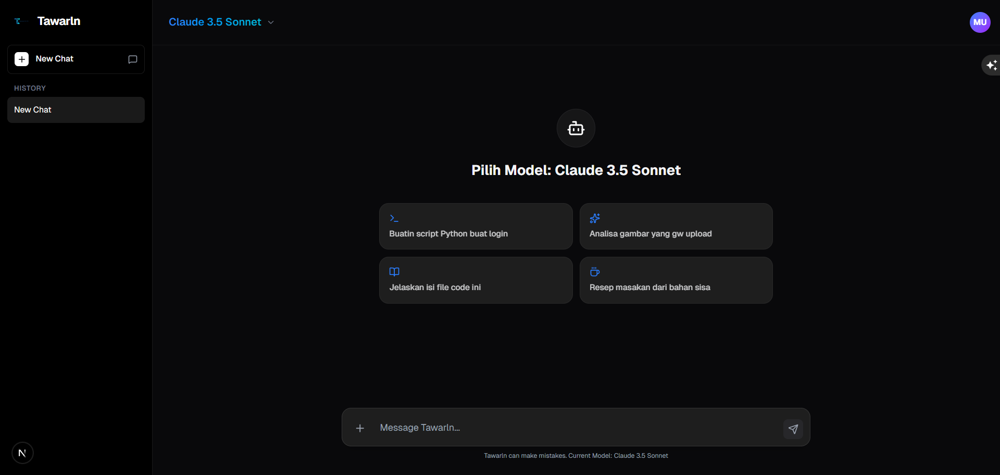
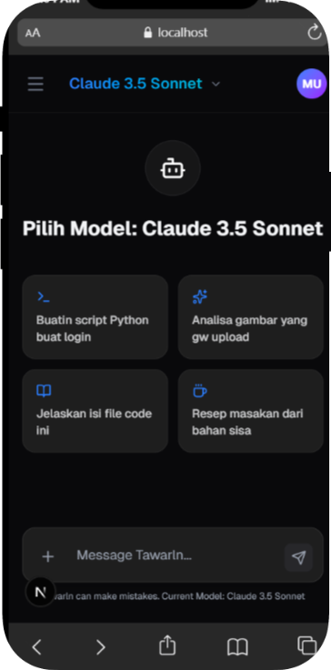

# 🤖 Tawarln AI

**Tawarln AI** is a multi-model AI chat platform built for **speed, control, and scalability**.  
It provides a single, clean interface to access multiple Large Language Models (LLMs) without vendor lock-in, UX friction, or security compromises.

Designed for builders today, scalable for teams and enterprises tomorrow.

---

## 🚀 What We’re Building (VC Snapshot)

- **Problem**: AI tools are fragmented — different models, different apps, inconsistent UX.
- **Solution**: One platform. Multiple AI models. Unified experience.
- **Differentiation**: Model-agnostic, fast UX, security-first architecture.
- **Vision**: Become the default AI workspace in Southeast Asia.

---

## 🧠 Core Features

- **🧠 Multi-Model Support**  
  Instantly switch between Claude, Llama, Qwen, and more via Kolosal AI.

- **👁️ Computer Vision**  
  Upload images for analysis, description, OCR, and code extraction.

- **⚡ Streaming Response**  
  Real-time output for fast, natural conversations.

- **☁️ Cloud Sync**  
  Google authentication with chat history synced across devices.

- **🔒 Secure by Design**  
  Supabase Auth with Row Level Security (RLS) enabled.

---

## 🎯 Target Market

- Developers & Engineers  
- Startup Founders & Product Teams  
- Researchers & AI Power Users  
- Tech-enabled SMEs

Go-to-market focus: **Individual power users → Teams → Enterprise**.

---

## 🛠️ Tech Stack

- **Framework**: Next.js 14 (App Router)  
- **Styling**: Tailwind CSS  
- **Database & Auth**: Supabase (Auth + RLS)  
- **AI Provider**: Kolosal AI (OpenAI-compatible API)  
- **Deployment**: Vercel  

Built for iteration today and scale tomorrow.

---

## 📸 Screenshots

  

---

## 🗺️ Roadmap

- Workspace & team collaboration  
- Prompt presets & marketplace  
- AI workflow automation  
- Enterprise deployment & custom routing  

---

## 🧭 Vision

The future of AI is not one perfect model —  
it’s a **flexible platform that adapts faster than the models themselves**.

**Tawarln AI** is built as an AI control center, not just another chatbot.

---

## 👨‍💻 Founder

**Muhammad Zaidan Faiz**  
Founder – Zaidan Capital

---

## 📬 Contact

For partnership, investment, or collaboration inquiries:  
📧 contact@zaidancapital.com

---

> Investor note: This repository represents the product layer only.  
> Traction, monetization, and financials are shared privately.
