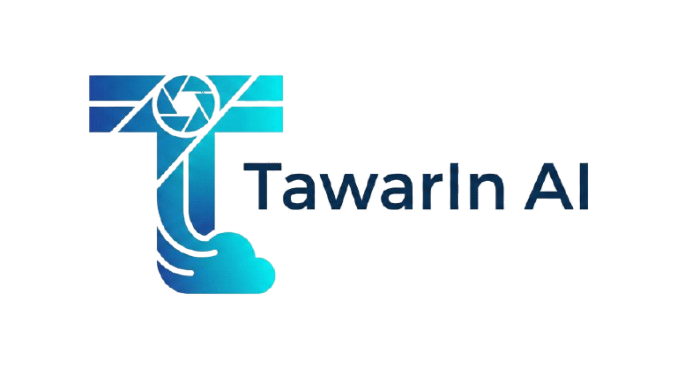

# 🤖 Tawarln AI

**Tawarln AI** is a modern, feature-rich AI Chat Assistant built to provide a seamless conversational experience. Powered by **Next.js 14**, **Supabase**, and **Kolosal AI**, it bridges the gap between powerful LLMs and user-friendly interface.

 ## 🚀 Features

- **🧠 Multi-Model Support**: Switch between Claude 3.5 Sonnet, Llama 3, Qwen, and more instantly.
- **👁️ Computer Vision**: Upload images and let the AI analyze, describe, or extract code from them.
- **⚡ Streaming Response**: Real-time typing effect for a smooth conversational flow.
- **☁️ Cloud Sync**: Never lose your chats. Sign in with Google to sync history across devices (Laptop & Mobile).
- **🎨 Modern UI**: Clean, dark-mode interface built with Tailwind CSS.
- **🔒 Secure**: Enterprise-grade authentication via Supabase Auth (RLS enabled).

## 🛠️ Tech Stack

- **Framework**: [Next.js 14](https://nextjs.org/) (App Router)
- **Styling**: [Tailwind CSS](https://tailwindcss.com/)
- **Database & Auth**: [Supabase](https://supabase.com/)
- **AI Provider**: [Kolosal AI](https://kolosal.ai/) / OpenAI Compatible API
- **Deployment**: [Vercel](https://vercel.com/)

## 📸 Screenshots

*(Tambahin screenshot web lu di sini nanti biar keren)*

## 👨‍💻 Developed By

**Muhammad Zaidan Faiz** *Zaidan Capital*